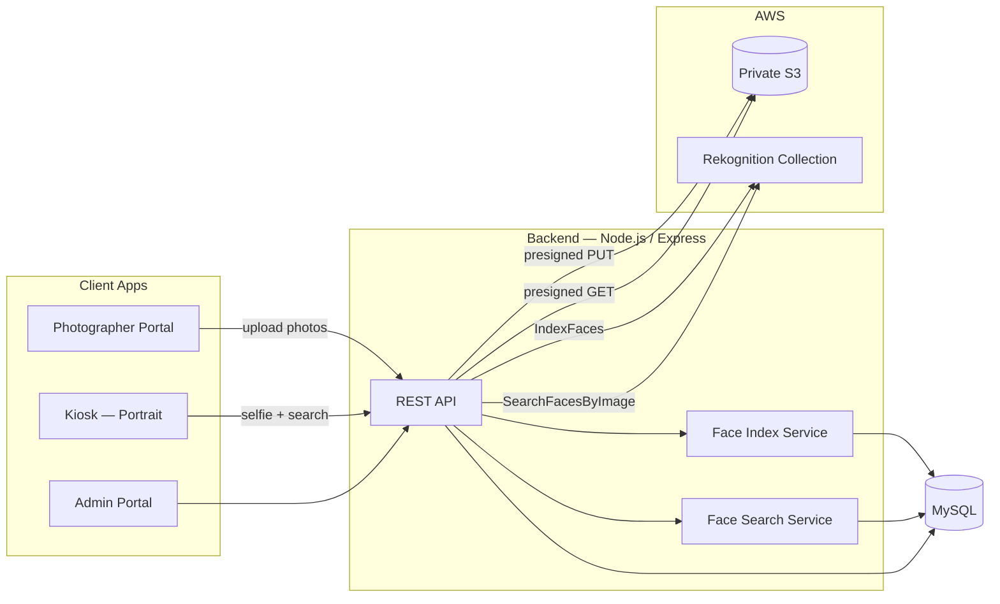

# FaceCraft

**AI-powered photo commerce platform for theme parks, events, and on-site photography studios.**

Customers take a selfie at a portrait kiosk, FaceCraft finds their photos using facial recognition, and they browse, frame, and purchase packages on the spot. Photographers upload event photos from a dedicated portal; operators manage the full business from a web admin panel.

---

## Built by

**Muhammad Ilyas Amran** — solo full-stack engineer

Designed, architected, and implemented end-to-end: system design, database schema, AWS integration, API layer, three frontend portals, deployment pipeline, and production operations on EC2.

---

## What this project demonstrates

| Area | Highlights |
|------|------------|
| **System design** | Monorepo, shared contracts, presigned S3 uploads, Rekognition face index/search, role-based auth |
| **Full-stack delivery** | 60+ Next.js routes, REST API, MySQL + Prisma, private S3 asset pipeline |
| **Product thinking** | Portrait kiosk UX (1080×1920), manual search fallback, 7-day photo retention, multi-payment checkout |
| **Production ops** | EC2 + PM2 + Nginx, structured logging (Pino), env-driven configuration, migration scripts |

---

## System overview

FaceCraft connects three user experiences to one backend:



### Core user flows

**1. Photographer → index faces**

1. Photographer uploads photos via presigned S3 URL  
2. API confirms upload and calls AWS Rekognition `IndexFaces`  
3. Face IDs are stored in MySQL and linked to each photo  
4. Photos remain searchable until retention expiry (default 7 days)

**2. Customer → find & buy photos**

1. Customer logs into the kiosk and captures a portrait selfie  
2. Selfie is uploaded to S3; API runs `SearchFacesByImage`  
3. Matching face IDs are resolved to photographer photos in the database  
4. Customer selects photos, applies frames, picks packages, and checks out  
5. If no match is found, manual browse by date/time is available

**3. Admin → operate the business**

Manage kiosks, photographers, products, combo packages, frames, AI effects, discounts, orders, roles, and reports — all from a single admin dashboard.

---

## Architecture & system design decisions

These decisions were made intentionally to balance security, cost, and speed of solo delivery.

### Monorepo with shared contracts

```
facecraft/
├── apps/
│   ├── api/          # Express REST API
│   └── web/          # Next.js 14 (App Router)
├── packages/
│   └── contracts/    # Shared Zod schemas, enums, API types
└── infrastructure/   # Nginx, PM2, EC2 scripts
```

**Why:** API and web share validation rules (`Zod`) and response shapes via `@facecraft/contracts`. One source of truth prevents drift between frontend forms and backend validators.

### Direct-to-S3 uploads (presigned URLs)

Photos and selfies never pass through the API body. The server issues short-lived presigned PUT/GET URLs; clients upload and download directly from a **private S3 bucket**.

**Why:** Lower API memory/bandwidth, faster uploads on kiosk hardware, and cleaner separation of storage from compute.

### AWS Rekognition as the face engine

- **Index:** `IndexFaces` on photographer photos (up to 15 faces per image)  
- **Search:** `SearchFacesByImage` on customer selfies  
- **Link:** Rekognition `FaceId` ↔ `photographer_photo_faces` in MySQL  

**Why:** Managed biometric search without building or hosting ML models. Configurable match threshold (`FACE_MATCH_THRESHOLD`, default 80%).

### MySQL as the source of business truth

Rekognition stores face vectors; MySQL stores ownership, expiry, photographer linkage, orders, and catalog data. Search results are always filtered through the database (e.g. expired photos excluded).

**Why:** Rekognition answers “who looks like this?” — the database answers “which photos can this customer see and buy?”

### Three auth surfaces, one API

| Portal | Auth mechanism |
|--------|----------------|
| Admin | Email/username login, JWT in HTTP-only cookie, role-based access |
| Kiosk | Kiosk username/password, session stored client-side |
| Photographer | Username login, photographer-scoped routes |

**Why:** Each channel has different trust boundaries; kiosk sessions are device-scoped, admin routes enforce RBAC.

### Portrait-first kiosk UX

Kiosk layout is designed for **1080×1920** portrait displays (theme park / event stand use case): full-height shell, minimal whitespace, webcam capture, frame slider, two-column shop layout.

**Why:** Real deployment target is a vertical touchscreen, not a desktop browser.

### Asset delivery without public buckets

Brand logos, spinner, kiosk hero video, and customer photos are served from private S3 via API proxies or presigned URLs — the bucket is never opened to the public.

**Why:** Security and control over sensitive customer imagery.

---

## Tech stack

### Frontend — `apps/web`

| Layer | Technology |
|-------|------------|
| Framework | **Next.js 14** (App Router), **React 18**, **TypeScript** |
| Styling | **Tailwind CSS**, **tailwindcss-animate**, CSS custom properties (brand palette) |
| UI components | **Radix UI** (Dialog, Dropdown, Select, Toast, Popover, Avatar, Label) |
| Forms & validation | **React Hook Form**, **Zod**, **@hookform/resolvers** |
| Data fetching | **TanStack React Query**, **Axios** |
| Tables | **TanStack React Table** |
| Motion | **Framer Motion** |
| Icons | **Lucide React** |
| Fonts | **Plus Jakarta Sans**, **Nunito** (@fontsource) |
| Kiosk capture | **react-webcam** |
| Dates | **date-fns**, **react-day-picker** |
| Utilities | **clsx**, **tailwind-merge**, **class-variance-authority** |

### Backend — `apps/api`

| Layer | Technology |
|-------|------------|
| Runtime | **Node.js 20+**, **TypeScript** |
| HTTP | **Express 4**, **express-async-errors** |
| ORM | **Prisma 5** + **MySQL** |
| Validation | **Zod** (via shared contracts) |
| Auth | **jsonwebtoken**, **bcryptjs**, HTTP-only cookies |
| Security | **Helmet**, **CORS**, **compression** |
| Logging | **Pino**, **pino-http**, **pino-pretty** (dev) |
| Images | **Sharp** |
| IDs | **uuid**, **nanoid** |
| Archives | **JSZip** |
| Dev runner | **tsx**, **Jest**, **ts-jest** |

### Shared — `packages/contracts`

| Purpose | Technology |
|---------|------------|
| API schemas | **Zod** |
| Shared enums & types | **TypeScript** |

### Cloud & infrastructure

| Service | Role |
|---------|------|
| **AWS S3** | Private photo storage (originals, selfies, branding, kiosk video) |
| **AWS Rekognition** | Face indexing and similarity search |
| **AWS EC2** | Production hosting |
| **MySQL** | Primary relational database |
| **Nginx** | Reverse proxy, rate limiting, static/API routing |
| **PM2** | Process manager (`facecraft-api`, `facecraft-web`) |

### Tooling & workflow

| Tool | Use |
|------|-----|
| **npm workspaces** | Monorepo dependency management |
| **concurrently** | Run API + web in dev |
| **ESLint** + **TypeScript ESLint** | Linting |
| **Prisma Migrate** | Schema migrations |
| **Git / GitHub** | Version control & deploy source |

---

## Application modules

### Admin portal (`/admin`)

- Dashboard and operational overview  
- **Catalog:** products, sizes, combo packages, discounts, frames, objects, ultra-objects  
- **People:** photographers, staff roles, kiosks  
- **Commerce:** orders, order detail  
- **Reports:** sales, kiosk, photographer, staff  
- **Settings:** privacy policy  

### Kiosk (`/kiosk`)

- Device login  
- Home (hero video, navigation tiles)  
- Selfie capture → **face search**  
- Photo selection (face matches or manual browse)  
- Frame picker (slider UI)  
- Shop (packages + album)  
- Cart & receipt  

### Photographer portal (`/photographer`)

- Login and upload dashboard  
- Batch photo upload to S3 with automatic face indexing  
- Upload history grouped by session/day  
- Stats (lifetime and daily upload counts)  

---

## API surface (mounted routes)

| Prefix | Responsibility |
|--------|----------------|
| `/api/health` | Health checks |
| `/api/v1/auth` | Admin, kiosk, and photographer authentication |
| `/api/v1/kiosks` | Selfie upload, face search, photo browse, frames, shop catalog, orders |
| `/api/v1/photographer` | Photo upload, confirm, delete, history, stats |
| `/api/v1/admin` | Admin CRUD, reports, catalog management |
| `/api/v1/assets` | Brand assets, kiosk video streaming (Range support), catalog uploads |

---

## Database models (Prisma)

Core entities include: **User**, **Kiosk**, **Product**, **ComboProduct**, **Discount**, **Frame**, **ObjectMaster**, **UltraObject**, **Order**, **OrderCombo**, **OrderPhoto**, **PhotographerPhoto**, **PhotographerPhotoFace**.

Face indexing status is tracked per photo: `PENDING` → `INDEXED` | `NO_FACE` | `FAILED`.

---

## Environment configuration

Key variables (see `apps/api/.env.example`):

```env
DATABASE_URL=mysql://...
AWS_REGION=ap-southeast-1
S3_BUCKET_NAME=facecraft-private-photos
REKOGNITION_COLLECTION_ID=facecraft-photos
FACE_MATCH_THRESHOLD=80
PHOTO_RETENTION_DAYS=7
SIGNED_URL_TTL_SECONDS=300
```

Brand and kiosk media keys (`BRAND_LOGO_S3_KEY`, `KIOSK_HOME_VIDEO_S3_KEY`, etc.) keep marketing assets in S3 while the web app serves them through controlled API routes.

---

## Getting started (local)

**Requirements:** Node.js 20+, npm 10+, MySQL 8+, AWS credentials with S3 + Rekognition access.

```bash
# Install dependencies
npm install

# Configure environment
cp apps/api/.env.example apps/api/.env
cp apps/web/.env.local.example apps/web/.env.local
# Edit both files with your values

# Database
npm run db:generate
npm run db:migrate
npm run db:seed

# Development (API on :4000, web on :3000)
npm run dev
```

Useful scripts:

```bash
npm run build              # Build contracts, API, and web
npm run typecheck          # Type-check all workspaces
npm run db:reindex-faces   # Re-index pending/failed photographer photos
npm run s3:upload-catalog  # Upload catalog images to S3
```

---

## Production deployment

Production runs on **AWS EC2** with:

1. `git pull` on the server  
2. `npm install` → `npm run db:generate` → `npm run build`  
3. **PM2** restart for API and Next.js  
4. **Nginx** as reverse proxy with rate limits on `/api/`

Infrastructure configs live in `infrastructure/` (Nginx site, PM2 ecosystem, deploy scripts).

---

## Project structure

```
facecraft/
├── apps/
│   ├── api/
│   │   ├── prisma/           # Schema, migrations, seed, reindex scripts
│   │   └── src/
│   │       ├── routes/       # Express route modules
│   │       ├── services/     # S3, Rekognition, face indexing, auth
│   │       ├── middleware/   # Auth, validation, errors
│   │       └── config/       # Env, logger
│   └── web/
│       └── src/
│           ├── app/          # Next.js App Router pages
│           ├── components/   # Admin, kiosk, photographer, UI
│           └── lib/          # API clients, session storage, kiosk UI tokens
├── packages/contracts/       # Shared Zod schemas & types
└── infrastructure/           # Nginx, PM2, EC2 setup
```

---

## Security considerations

- Private S3 bucket; access only via presigned URLs or authenticated API proxies  
- HTTP-only cookies for admin sessions  
- Helmet security headers; Nginx rate limiting  
- Face match threshold configurable; expired photos excluded from search  
- Biometric data processed by AWS Rekognition; app stores face IDs and metadata, not raw embeddings in MySQL  
- Role-based admin access (Admin, Manager, Supervisor, Account Manager, Staff)

---

## Author

**Muhammad Ilyas Amran**

Solo builder — product vision, system architecture, backend, frontend, AWS integration, database design, and production deployment.

If you're reviewing this project on LinkedIn or GitHub: this is a complete, production-oriented platform built to solve real on-site photo sales at scale, not a tutorial clone.

---

## License

Private / proprietary. All rights reserved.
